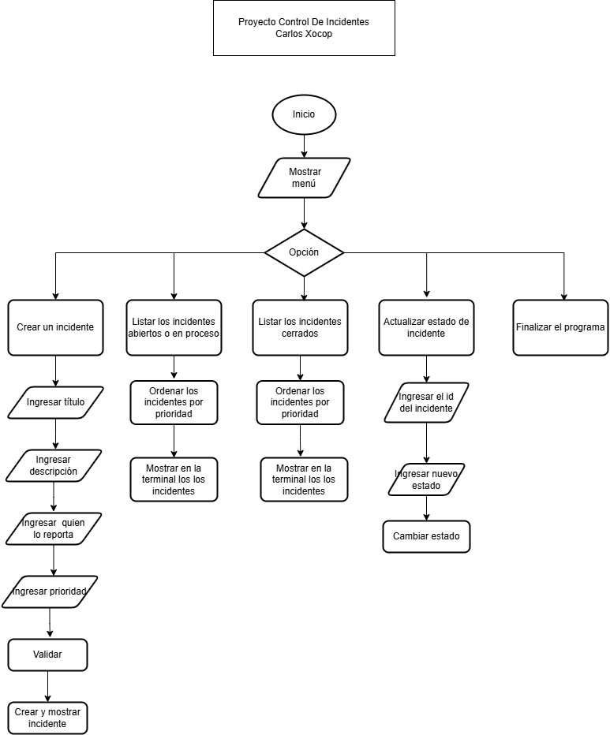

# Control De Incidentes

Aplicación monolítica de consola que permite gestionar incidentes.

## Tecnologías
* TypeScript
* Node.js

## Requisitos
* Node.js version 22.22.3 o superior
* pnpm instalado

## Instalación y Ejecución

1. Clonar repositorio
2. https://github.com/cxocop-2025287/ControlIncidentes
3. Abrir la terminal
3. Buscar el repositorio clonado
4. Instalar las dependencias con pnpm install
5. Compilar con el comando "pnpm build"
6. Ejecutar con el comando "pnpm start"

